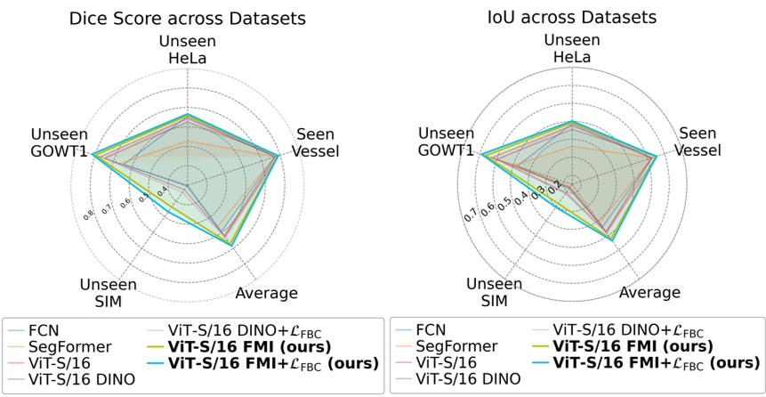

## 📄 Paper
This repository contains the official implementation of our paper:
**Domain-Specific Pretraining and Fine-Tuning with Contrastive Learning for Fluorescence Microscopic Image Segmentation**  

<p align="center">
  
</p>

## 🚀 Highlights
- **Domain-specific pretraining**: Vision Transformer pretrained on fluorescence microscopy images.  
- **Cross-image foreground-background contrastive learning**: Improves semantic boundary recognition and cross-dataset generalization.  
- **State-of-the-art performance**: Significant IoU and Dice gains over baselines, including on unseen biomarkers.  

## 📂 Repository Structure
```
├── configs/ # Configuration files for training & evaluation
├── datasets/ # Dataset preparation scripts
├── models/ # Model architecture (ViT backbone + segmentation head)
├── weights/ # Pretrained weights
├── utils/ # Helper functions (training, evaluation, visualization)
├── train.py # Training script
├── evaluate.py # Evaluation script
└── README.md
```

## 📊 Dataset Preparation
Prepare fluorescence microscopy datasets as described in the paper.

- **FMI-ViT Pretrain Data and VO Data**: Public access authorization is in progress.
- **Cell Tracking Challenge**: [Download Link](https://celltrackingchallenge.net/)

## 💻 Training

### **1. Pretraining (Domain-specific Self-supervised Learning)**
```
CUDA_VISIBLE_DEVICES=0,1，2，3 \
python -m torch.distributed.launch --nproc_per_node=4 main_dino.py \
  --arch vit_small \
  --batch_size_per_gpu 400 \
  --data_path /path/to/dataset \
  --output_dir /path/to/save_model_dir
```

### **2. Fine-tuning (Foreground-Background Contrastive Learning)**
```
bash tools/train4.sh configs/our/small_upernet_our1.py \
  --work-dir /path/to/save_dir
```

### **3. Evaluation**
```
bash tools/test.sh configs/our/small_upernet_test.py \
  /path/to/checkpoint.pth \
  --show-dir /path/to/output_visualization \
  --work-dir /path/to/output_results \
  --out /path/to/output_predictions
```

## 📥 Pretrained Weights
You can choose to download only the pretrained teacher backbone weights for downstream tasks, or the full checkpoint containing the backbone as well as the projection head weights for both the teacher network and the teacher network. We also provide the pretrained teacher backbone weights in the MMSegmentation
Pretrained weights and fine-tuned models can be downloaded here:
| arch     | params | download |
|----------|--------|----------|
| ViT-S/16 | 21M    | [full ckpt](https://drive.google.com/file/d/1X3XaOu6tBkV0WxoaAQ8Xb0O1Oh_fZiDg/view?usp=sharing) \| [teacher backbone only](https://drive.google.com/file/d/1xvHhn9wYdoYs4dfVEyEVZtOPnHwPssW2/view?usp=sharing) \| [teacher backbone only (mmseg)](https://drive.google.com/file/d/1vl5PrOwyL2fejajEFcY317h0TShbsnM0/view?usp=sharing) \| 

## 📜 Citation
If you use this repository or our pretrained weights, please cite:
```
@inproceedings{yourbibkey2025,
  title={Domain-Specific Pretraining and Fine-Tuning with Contrastive Learning for Fluorescence Microscopic Image Segmentation},
  author={Yunheng Wu, et al.},
  booktitle={Proceedings of ...},
  year={2025}
}
```
## 🙏 Acknowledgements
This repository is built upon the excellent works of:

- [DINO](https://github.com/facebookresearch/dino) — Pretraining
- [MMsegmentation](https://github.com/open-mmlab/mmsegmentation) — Fine-tuning

We sincerely thank the authors for releasing their codes and making this research possible.
